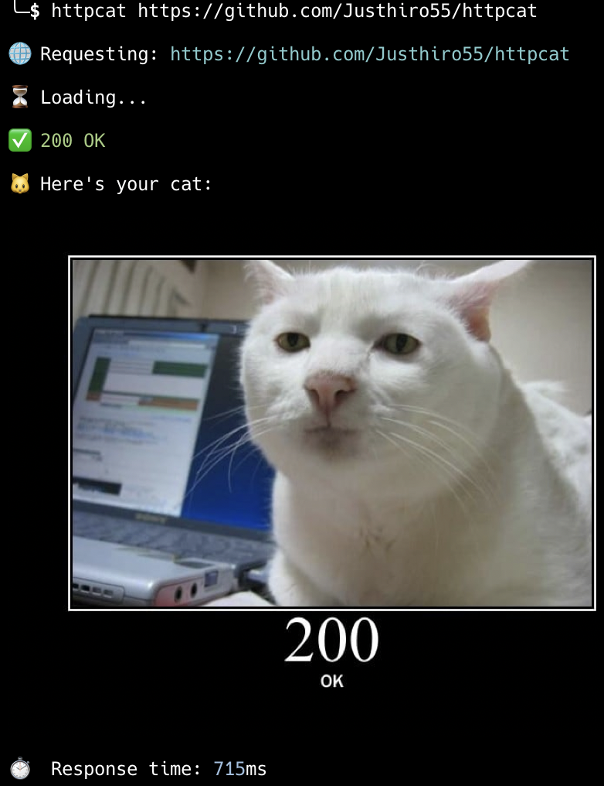

# httpcat

[](https://crates.io/crates/httpcat)
[](https://crates.io/crates/httpcat)
[](https://github.com/Justhiro55/httpcat/actions)
[](LICENSE)
[](https://www.rust-lang.org/)

> A CLI HTTP client that shows cat images based on status codes 🐱

Send HTTP requests and get adorable cat images from [http.cat](https://http.cat) displayed right in your terminal based on the response status code.

<p align="center">
  
</p>

## Installation

### Using Cargo

```bash
cargo install httpcat
```

### From source

```bash
git clone https://github.com/Justhiro55/httpcat
cd httpcat
cargo install --path .
```

## Usage

```bash
$ httpcat https://example.com

🌐 Requesting: https://example.com

⏳ Loading...

✅ 200 OK

🐱 Here's your cat:

[cat image displayed in terminal]

⏱️  Response time: 234ms
```

```bash
$ httpcat https://example.com/notfound

🌐 Requesting: https://example.com/notfound

⏳ Loading...

❌ 404 Not Found

🐱 Here's your cat:

[404 cat image]

⏱️  Response time: 156ms
```

### Options

```bash
httpcat [OPTIONS] <URL>
```

- `-X, --method <METHOD>` - HTTP method to use (default: GET)
- `--size <N>` - Image width in terminal characters (default: 60)
- `--ascii` - Display image as ASCII art
- `--no-image` - Don't display cat image
- `--headers` - Show response headers
- `--body` - Show response body
- `-H, --header <HEADER>` - Add request header (can be used multiple times)
- `-h, --help` - Print help
- `-V, --version` - Print version

### Examples

**POST request:**
```bash
httpcat -X POST https://api.example.com/data
```

**With custom headers:**
```bash
httpcat -H "Authorization: Bearer token123" https://api.example.com
```

**Show response details:**
```bash
httpcat --headers --body https://example.com
```

**ASCII art mode:**
```bash
httpcat --ascii https://example.com
```

**Status check only:**
```bash
httpcat --no-image https://example.com
```

## License

Licensed under either of MIT or Apache-2.0 at your option. See [LICENSE](LICENSE) for details.

## Credits

Cat images are provided by [https://http.cat](https://http.cat).
